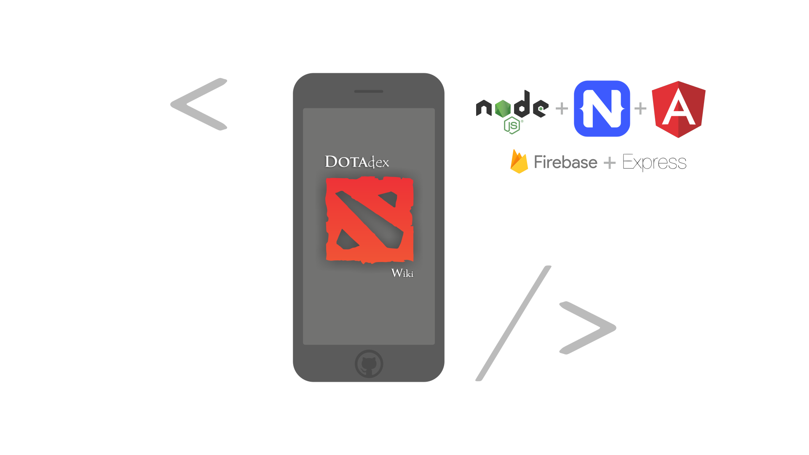

# Dotadex 

Mini wikipedia for Dota 2 ❤️



## Getting Started 🤘
Backend & Frontend

go to: 
**`toda-wiki/src/app/service/nodejs-api.ts`** file and, change endpoint with your local IP
 
&&

go to:
**`toda-wiki/src/app/service/nodejs-api.ts`** file and, change endpoint with your local IP 

- yes manually 🙄


## Backend Service Running Steps

#### Firebase Settings Steps

❗️You need get the **Firebase Admin SDK** from [Firebase Console](https://console.firebase.google.com/) with your Google Account and you should to replace **firebase-server/service-account-key.json** file with the contents of the downloaded file.

and then 👇
```
cd firebase-server
npm install
nodemon [LOCAL_IP_ADDRESS]
``` 

## Frontend  Running Steps

```
cd toda-wiki
npm install
``` 
and

`tns preview` ( for running on your phone ) 
or
`tns run ios` ( for running on emulator )

and enjoy! 🎉🎉


   
## Built With

* [Firebase](https://firebase.google.com/docs/cli/) - Cloud Storage
* [NativeScript](https://docs.nativescript.org/angular/start/quick-setup) -  Cross Platform Mobile App Framework with Angular template
* [Node.js](https://nodejs.org) - Backend Service

## Article
* [TR] Blog Post on Medium: [Dotadex](https://medium.com/@onuria/dotadex-b%C3%B6l%C3%BCm-3-ffec1bb9c4ed?source=friends_link&sk=d6f0ed2f05743c6e169dfb5ffc3e80ba)

## Contributors

* **Onur Uzun**  - [GitHub](https://github.com/onuruzun),  [Twitter](https://twitter.com/onuriart)


## License

This project is licensed under the MIT License.
